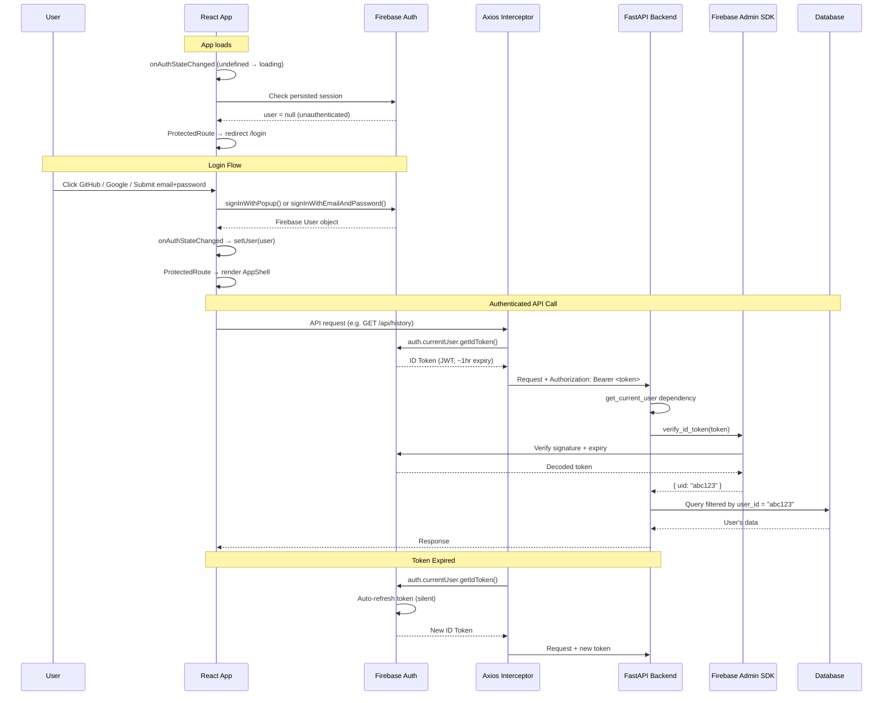

# Vayu Research - Project Flow

## Overview

Vayu Research is a personal financial research tool that runs curated prompts against LLMs and delivers results via History, Notion, Email, or Telegram.

---

## Architecture

```
┌─────────────┐     ┌─────────────────┐     ┌──────────────────┐
│   Frontend  │────▶│  FastAPI Backend │────▶│      LLM         │
│   (React)   │     │   (Python)       │     │ (Anthropic/OpenAI│
│             │     │                  │     │  OpenRouter)     │
└─────────────┘     └────────┬─────────┘     └──────────────────┘
                            │
              ┌─────────────┼─────────────┐
              ▼             ▼             ▼
         ┌─────────┐  ┌──────────┐  ┌───────────┐
         │ SQLite  │  │ Notion   │  │ Email/    │
         │ (Data)  │  │ API      │  │ Telegram  │
         └─────────┘  └──────────┘  └───────────┘
```

---

## User Flows

### 1. Prompt Execution Flow (Manual)

```
User Action              Backend Process              Storage/Delivery
    │                        │                            │
    ▼                        ▼                            ▼
┌─────────┐            ┌───────────┐              ┌───────────┐
│ Select │───────────▶│ Load      │              │           │
│ Prompt │            │ Prompt    │              │           │
└─────────┘            └─────┬─────┘              │           │
                              │                    │           │
                              ▼                    │           │
┌─────────┐            ┌───────────┐              │           │
│ Fill   │───────────▶│ Validate  │              │           │
│ Inputs │            │ Inputs    │              │           │
└─────────┘            └─────┬─────┘              │           │
                              │                    │           │
                              ▼                    │           │
┌─────────┐            ┌───────────┐              │           │
│ Click  │───────────▶│ Resolve   │              │           │
│ "Run"  │            │ Model     │              │           │
└─────────┘            └─────┬─────┘              │           │
                              │                    │           │
                              ▼                    ▼           ▼
                        ┌───────────┐        ┌───────────┐ ┌─────────┐
                        │ Call LLM  │───────▶│ Save to   │ │ Send    │
                        │ (API)     │        │ History   │ │ Notion  │
                        └───────────┘        └───────────┘ │ (if     │
                                                          │ enabled)│
                                                          └─────────┘
```

**Step-by-step:**

1. **Frontend** (`PromptRunner.jsx`):
   - User selects a prompt from PromptsPage
   - User fills in placeholder inputs
   - User clicks "Run →"
   - Calls `runPrompt(promptId, inputs)` API

2. **Backend** (`routers/run.py`):
   - Receives `RunRequest` with `prompt_id` and `inputs`
   - Loads prompt template from `data/prompts.json`
   - Validates all required placeholders are provided
   - Fills in placeholders in prompt template
   - Resolves model via `config.resolve_model_for_category()` (checks: request → category config → LIVE_MODE)
   - Calls LLM via `_call_llm(provider, model, content, db)`

3. **LLM Execution**:
   - Supports 3 providers: `anthropic`, `openai`, `openrouter`
   - Uses appropriate SDK to call the selected model

4. **Save to History**:
   - Creates `History` record with prompt_id, inputs, result, model_used
   - Saved to SQLite database

5. **Notion Auto-save** (if enabled):
   - If `auto_save_notion` setting is enabled
   - Converts markdown result to Notion blocks
   - Creates child page under category's Notion page

---

### 2. Scheduled Execution Flow

```
User Creates          Backend Process              Trigger              Delivery
   │                        │                        │                     │
   ▼                        ▼                        ▼                     ▼
┌─────────┐           ┌───────────┐          ┌───────────┐         ┌───────────┐
│ Create │──────────▶│ Save      │          │ APScheduler│        │ Email     │
│ Schedule│          │ Schedule  │─────────▶│ Cron Job   │───────▶│ (Gmail)   │
└─────────┘           │ to DB     │          │            │         └───────────┘
                      └─────┬─────┘          └───────────┘         ┌───────────┘
                            │                                        │ Telegram
                            ▼                                        ▼
                      ┌───────────┐                           ┌───────────┐
                      │ Register  │                           │ Telegram  │
                      │ Job with  │                           │ Bot API   │
                      │ APScheduler                           └───────────┘
                      └───────────┘
```

**Step-by-step:**

1. **User** creates a schedule via `SchedulesPage`:
   - Selects prompt
   - Sets frequency (daily/weekdays/weekly)
   - Sets run time
   - Enables notifications (email/Telegram)

2. **Backend** (`routers/schedules.py`):
   - Saves schedule to `Schedule` table
   - Calls `scheduler.register_schedule(schedule)`

3. **APScheduler** (`scheduler.py`):
   - Registers cron job based on frequency and time
   - Fires at scheduled time

4. **Scheduled Job Execution** (`_run_scheduled_job`):
   - Loads prompt and fills inputs
   - Resolves model
   - Calls LLM
   - Saves to History
   - Saves to Notion (if configured)
   - Sends Email (if `notify_email` enabled)
   - Sends Telegram message (if `notify_telegram` enabled)

---

### 3. Notion Integration Flow

```
Frontend                    Backend                    Notion API
    │                         │                          │
    ▼                         ▼                          │
┌─────────┐            ┌───────────┐              ┌───────────┐
│ Select │───────────▶│ Test      │─────────────▶│ GET       │
│ Page   │            │ Connection│              │ /pages/{id}│
└─────────┘            └─────┬─────┘              └───────────┘
                            │                          │
                            ▼                          ▼
                     ┌───────────┐              ┌───────────┐
                     │ Convert   │─────────────▶│ POST      │
                     │ Markdown  │              │ /pages    │
                     │ to Blocks │              └───────────┘
                     └───────────┘
```

**Step-by-step:**

1. **Configuration**:
   - Set `NOTION_TOKEN` in .env
   - Set `NOTION_PAGE_ID` (global) or per-category in `category_config.json`
   - Share Notion page with integration

2. **Markdown to Notion Blocks** (`notifier.py`):
   - `_md_to_notion_blocks()` converts markdown to Notion blocks
   - Handles: headings, bullet lists, numbered lists, tables, dividers
   - Parses inline markdown: `**bold**`, `*italic*`, `` `code` ``

3. **Create Page**:
   - `send_notion_page()` - creates child page under parent
   - `send_notion_db_entry()` - creates row in Notion database

---

### 4. Email/Telegram Notification Flow

**Email:**
```
Backend                         Gmail SMTP                    User Email
    │                               │                            │
    ▼                               ▼                            ▼
┌─────────┐                 ┌───────────┐              ┌───────────┐
│ Compose │────────────────▶│ Connect   │─────────────▶│ Receive   │
│ Subject │                 │ via SMTP  │              │ Email     │
│ & Body  │                 │ SSL       │              │           │
└─────────┘                 └───────────┘              └───────────┘
```

**Telegram:**
```
Backend                     Telegram Bot API              User Chat
    │                               │                        │
    ▼                               ▼                        │
┌─────────┐                 ┌───────────┐              ┌───────────┐
│ Format  │────────────────▶│ POST      │─────────────▶│ Receive   │
│ Message │                 │ /sendMessage            │ Message   │
└─────────┘                 └───────────┘              └───────────┘
```

---

## Frontend Pages Flow

```
┌────────────────────────────────────────────────────────────────────┐
│                         App.jsx                                    │
│  ┌──────────────────────────────────────────────────────────────┐  │
│  │                    React Router                              │  │
│  │  ┌──────────┐ ┌──────────┐ ┌──────────┐ ┌────────┐ ┌───────┐ │  │
│  │  │ /        │ │ /prompt  │ │ /history │ │/sched- │ │/settin│ │  │
│  │  │Prompts   │ │ /:id     │ │          │ │ules    │ │gs     │ │  │
│  │  │Page      │ │Runner    │ │History   │ │Schedule│ │Settings│ │  │
│  │  │          │ │          │ │Page      │ │Page    │ │Page   │ │  │
│  │  └──────────┘ └──────────┘ └──────────┘ └────────┘ └───────┘ │  │
│  └──────────────────────────────────────────────────────────────┘  │
└────────────────────────────────────────────────────────────────────┘

PromptsPage ──────▶ PromptRunner ──────▶ HistoryPage
                         │                    │
                         │                    ▼
                         │              ┌──────────┐
                         │              │ Download │
                         │              │ .md file │
                         │              └──────────┘
                         │
                         ▼
                   ┌──────────┐
                   │ Settings │
                   │ Page     │
                   └──────────┘
```

---

## Model Resolution Order

```
Request ─▶ Category Config ─▶ LIVE_MODE Default
   │              │                   │
   │              │                   ▼
   │              │            DEFAULT_LIVE_MODEL
   │              │            or
   │              │            DEFAULT_DEMO_MODEL
   │              │
   └──────────────┴──▶ Used for LLM call
```

Priority:
1. Per-request override (user specifies provider/model)
2. Category config (`category_config.json` per category)
3. Global LIVE_MODE setting (live/demo)
4. Default model from config

---

## Data Models

### History
- `id`: Primary key
- `prompt_id`: Reference to prompt
- `prompt_name`: Display name
- `inputs`: JSON string of user inputs
- `result`: LLM response
- `source`: "manual" or "scheduled"
- `model_used`: Provider/model string
- `created_at`: Timestamp

### Schedule
- `id`: Primary key
- `prompt_id`: Reference to prompt
- `prompt_name`: Display name
- `inputs`: JSON string
- `frequency`: "daily" | "weekdays" | "weekly"
- `run_time`: "HH:MM" format
- `day_of_week`: For weekly schedules
- `is_active`: Boolean
- `notify_email`: Boolean
- `notify_telegram`: Boolean
- `provider`, `model_name`: Override defaults
- `last_run_at`: Timestamp

### Setting (Key-Value Store)
- `key`: Setting name
- `value`: Setting value

---

## 5. Authentication Flow (Firebase)

### Frontend → Backend sequence



**Key design decisions:**

- `user === undefined` = loading, `user === null` = unauthenticated — prevents flash of unauthenticated content in `ProtectedRoute`
- Firebase handles token refresh silently — `getIdToken()` auto-refreshes if within expiry window
- Axios interceptor attaches Bearer token to every request — auth is transparent to all API calls
- Backend never stores tokens — verifies on each request via Firebase Admin SDK
- `user_id` (Firebase UID) scopes all DB queries — `WHERE user_id = ?` on every history, schedule, and setting query

**Relevant files:**

| Layer | File | Responsibility |
|---|---|---|
| Frontend | `src/auth/firebase.js` | Firebase app init, auth providers |
| Frontend | `src/auth/AuthContext.jsx` | `onAuthStateChanged` → `useAuth()` hook |
| Frontend | `src/auth/ProtectedRoute.jsx` | Redirect unauthenticated users |
| Frontend | `src/auth/LoginPage.jsx` | GitHub / Google / email login UI |
| Frontend | `src/auth/SignupPage.jsx` | Email sign-up UI |
| Frontend | `src/api.js` | Axios interceptor attaching Bearer token |
| Backend | `backend/auth/firebase.py` | Thread-safe Firebase Admin SDK init |
| Backend | `backend/auth/dependencies.py` | `get_current_user` FastAPI dependency |
| Backend | `backend/routers/*.py` | All routes use `Depends(get_current_user)` |

---

## API Endpoints

| Method | Endpoint | Description |
|--------|----------|-------------|
| GET | `/api/prompts` | List all prompts |
| GET | `/api/prompts/{id}` | Get single prompt |
| POST | `/api/run` | Execute prompt |
| POST | `/api/run/raw` | Run raw text |
| GET | `/api/history` | List history |
| DELETE | `/api/history/{id}` | Delete entry |
| GET | `/api/history/{id}/download` | Download .md |
| POST | `/api/history/{id}/notion` | Save to Notion |
| GET | `/api/schedules` | List schedules |
| POST | `/api/schedules` | Create schedule |
| PUT | `/api/schedules/{id}` | Update schedule |
| DELETE | `/api/schedules/{id}` | Delete schedule |
| PATCH | `/api/schedules/{id}/toggle` | Toggle active |
| GET | `/api/settings` | Get settings |
| PUT | `/api/settings` | Update settings |
| GET | `/api/config` | Get app config |
| GET | `/api/notion/test` | Test Notion connection |
